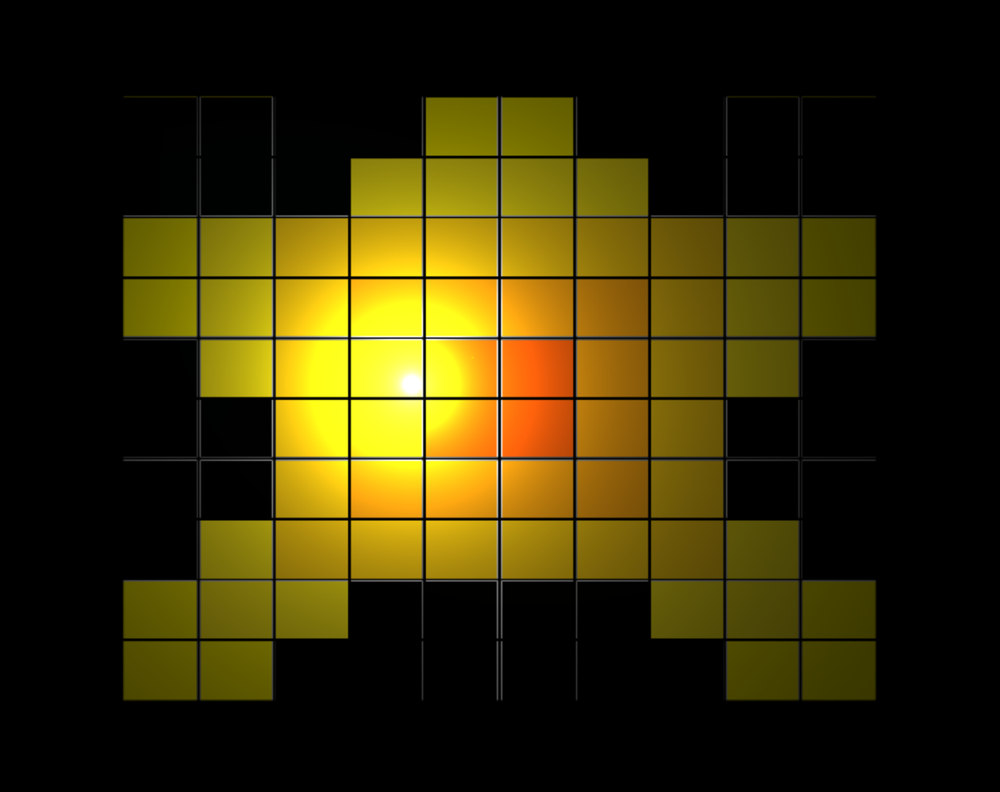
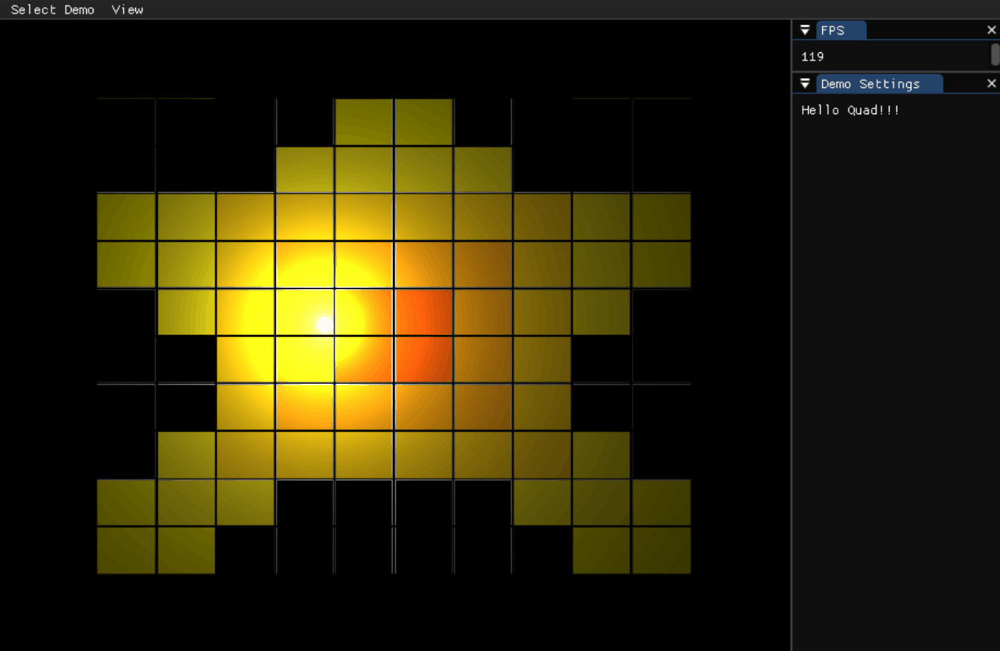

# Simple Graphic Engine 2

## Test many graphic Features!
**Fog, Toon Shading, Shadow Mapping, Geometry Shader, Tessellaion Shader, Compute Shader, Value Noise, Gradient Noise, Curve**  

---

## Snap Shots!

---

## Develope
Created using only C++ and OpenGL.
