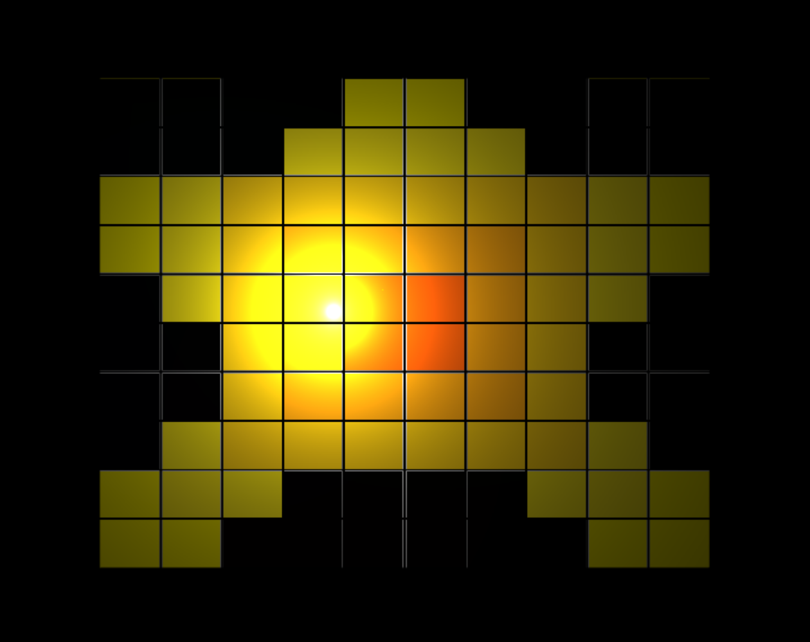
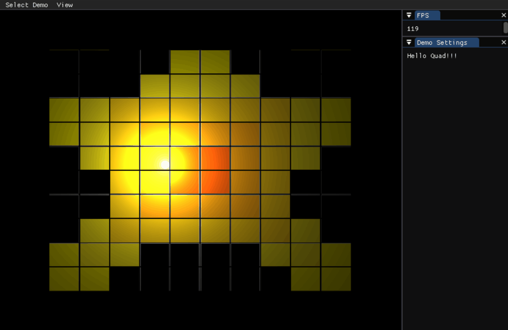

# Simple Graphic Engine 2
An OpenGL demo collection exploring real-time rendering techniques in C++.



 

## Features

- **Fog** — linear, exponential, and fragment-depth variants implemented in GLSL
- **Toon Shading** — custom range, uniform range, and gradient-texture approaches
- **Shadow Mapping** — depth-buffer-based shadow rendering with a separate depth pass
- **Geometry & Tessellation Shaders** — mesh extrusion, wireframe overlay, and adaptive subdivision via TCS/TES stages
- **Compute Shaders + Procedural Noise** — GPU-side image processing alongside Value Noise and Gradient Noise generation; Bézier Curve rendering via tessellation

## Demo



## Built With

- **C++** — core application logic and demo framework; all 11 demos share a common `IDemo` interface
- **GLSL** — per-demo shader sets (`.vert`, `.frag`, `.geom`, `.tesc`, `.tese`, `.comp`) kept alongside their C++ counterparts
- **OpenGL / GLEW** — graphics API; GLEW used for extension loading on the target platform
- **SDL2** — window creation and input handling, keeping platform setup separate from rendering code
- **GLM** — math types (vectors, matrices) that map directly to GLSL built-ins
- **Dear ImGui** — immediate-mode UI for per-demo parameter controls without a separate UI framework
- **STB** — single-header image loading for texture assets
- **CMake** — build configuration with per-dependency find-modules under `cmake/dependencies/`

## Getting Started

### Prerequisites

- CMake 3.x
- A C++17-capable compiler
- OpenGL 4.x-capable GPU and driver
- SDL2 development libraries installed on your system

### Installation

```bash
git clone https://github.com/Git-Mere/simple-graphic-project2.git
cd simple-graphic-project2/cs250-graphics-fun-Seungheon-digipen-main
cmake -B build
cmake --build build
```

### Run

```bash
./build/simple-graphic-engine2
```

## What I Learned

**Shadow Mapping — depth pass coordination**
Implementing shadow mapping meant rendering the scene twice: once from the light's point of view to write a depth texture (`write_depth`), then again from the camera while sampling that texture to decide whether each fragment is in shadow (`shadows.frag`). Getting the depth bias right to avoid shadow acne without causing Peter Panning required iterating on the fragment shader directly while watching results in real time.

**Tessellation pipeline — control and evaluation split**
The tessellation demos (D07, D11) required understanding the two-stage split between the Tessellation Control Shader (TCS) and the Tessellation Evaluation Shader (TES). The TCS sets per-patch subdivision levels; the TES positions the generated vertices. Writing separate `.tesc`/`.tese` pairs for quads, triangles, and lines (each with equal/even/odd spacing variants) made the interaction between those stages concrete.

**Compute Shaders — working outside the rasterization pipeline**
D08 introduced `layout(local_size_x, local_size_y)` workgroup dispatch for image-space operations (luminance conversion, color pulse). Because compute shaders write to image units rather than framebuffer attachments, they needed different synchronization (`glMemoryBarrier`) before the result texture could be sampled in the subsequent draw call.

**Noise generation — CPU-side permutation table, GPU-side lookup**
Value Noise (D09) and Gradient Noise (D10) both rely on a permutation hash table (`PermutationHash.hpp`) generated on the CPU and uploaded as a uniform buffer, while the actual interpolation and gradient mixing happen in the fragment shader. Keeping the table on the GPU avoided per-frame uploads and made the noise tile and animate without CPU involvement.

## License

No license has been specified for this repository.